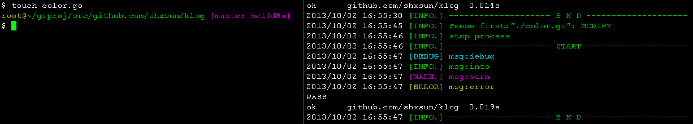

# fswatch

A definition of **fswatch**: Command line tool. Use file system event to trigger user defined commands. 


fswatch will follow 3 steps.

1. notify if file under current directory changes.
2. filter event by `.gitignore`
3. do user defined commands(passed by commands)

## How to use
*I will show you an example*

```
go get github.com/shxsun/fswatch
# cd to a golang project
# ...
fswatch go test

# open a new shell, cd to the same place
touch test.go

# now fswatch should do some tests. (if nothing happens, tell me)
```



## Friendly link: 

* [bee](https://github.com/astaxie/bee)
* [fsnotify](https://github.com/howeyc/fsnotify)
